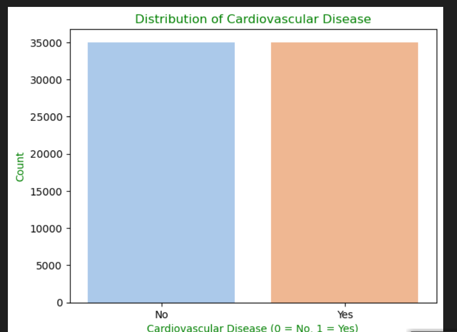
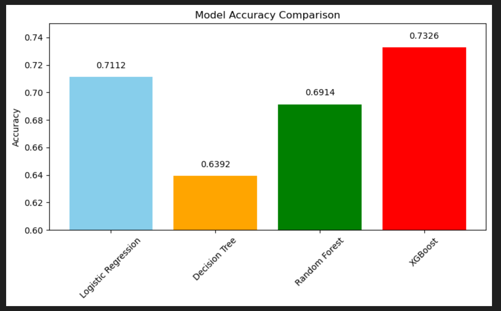
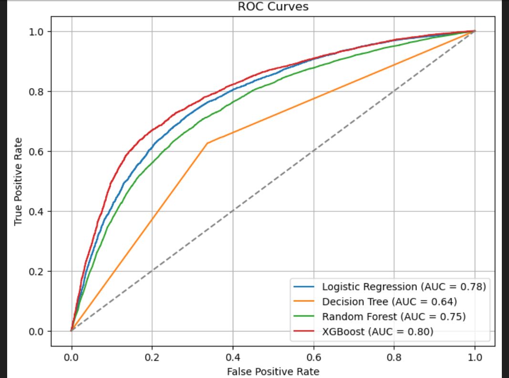
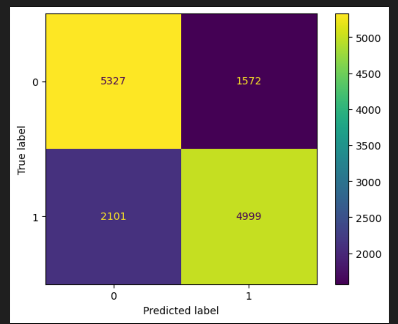
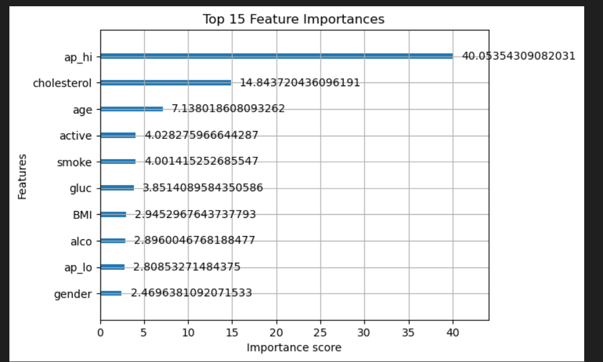

#  Cardiovascular Disease Prediction using Machine Learning

This project leverages supervised machine learning algorithms to predict the risk of cardiovascular disease (CVD) based on various health indicators. It involves extensive data cleaning, exploratory data analysis (EDA), model building, evaluation, and actionable recommendations.

---

##  Problem Statement

Cardiovascular disease is one of the leading causes of death globally. Early detection using machine learning can help identify high-risk individuals and take preventative actions. This project aims to build predictive models using health and lifestyle data to classify whether an individual is at risk for cardiovascular disease.

---

## 📂 Project Structure

---

##  Objectives

- Analyze the distribution and relationships between key health features.
- Build classification models to predict cardiovascular disease.
- Evaluate and compare model performance using various metrics.
- Provide data-driven recommendations and highlight potential limitations.

---

##  Technologies & Libraries

- **Python**: Programming language
- **Jupyter Notebook**: For analysis and documentation
- **Pandas / NumPy**: Data manipulation
- **Matplotlib / Seaborn**: Data visualization
- **Scikit-learn**: ML models and metrics
- **XGBoost**: Gradient boosting algorithm
- **LogisticRegressionCV**: Regularized logistic regression with built-in CV

---

##  Dataset Overview

The dataset contains information on several health-related attributes for individuals, including:

- Age (in days)
- Diastolic blood pressure
- Systollic blood pressure
- Gender
- Height and Weight
- Body Mass Index (BMI)
- Cholesterol level
- Glucose level
- Smoking status
- Alcohol intake
- Physical activity
- Presence of cardiovascular disease (target variable)

---

##  Methodology

### 1. Data Cleaning

- Converted age from days to years.
- One-hot encoded categorical features where appropriate.
- Ensured data types and class distributions were clean and usable.

### 2. Exploratory Data Analysis (EDA)
- Visualized age, gender, cholesterol, glucose, activity level, etc.
- Identified key relationships and patterns affecting cardiovascular risk.
- Detected skewed distributions and class imbalance.

### 3. Feature Engineering
- Created BMI from height and weight.
- Categorical feature encoding.
- Normalization of continuous features (optional depending on model).

### 4. Model Building
evaluated the following classifiers:
- **Logistic Regression with Cross-Validation**
- **Decision Tree**
- **Random Forest**
- **XGBoost Classifier**
  
Trained the top two perfoming models

### 5. Evaluation Metrics
Top models were evaluated using:
- Accuracy
- Precision, Recall, and F1-Score
- Confusion Matrix
- Cross-validation (where applicable)
- Classification Reports

---

## Results Summary

The dataset contains an approximately **equal number of individuals with and without cardiovascular disease**, indicating that the target variable is **balanced**. This is beneficial for training machine learning models, as it reduces the risk of bias toward one class.

Based on the cross-validation results, **Logistic Regression** and **XGBoost** emerged as the top-performing models in terms of **accuracy**

Based on the cross-validation results, **Logistic Regression** and **XGBoost** emerged as the top-performing models in terms of **AUC**

| Metric                      | Model               | Train Set - Class 0 | Train Set - Class 1 | Train Accuracy | Test Set - Class 0 | Test Set - Class 1 | Test Accuracy | AUC  |
|----------------------------|---------------------|----------------------|----------------------|----------------|---------------------|---------------------|----------------|------|
| **Precision**              | Logistic Regression | 0.71                 | 0.75                 | 0.73           | 0.71                | 0.75                | 0.73           | 0.79 |
| **Recall**                 | Logistic Regression | 0.78                 | 0.67                 |                | 0.78                | 0.67                |                |      |
| **F1-score**               | Logistic Regression | 0.74                 | 0.71                 |                | 0.74                | 0.71                |                |      |
| **Precision**              | XGBoost             | 0.74                 | 0.78                 | 0.76           | 0.71                | 0.75                | 0.73           | 0.79 |
| **Recall**                 | XGBoost             | 0.81                 | 0.72                 |                | 0.78                | 0.68                |                |      |
| **F1-score**               | XGBoost             | 0.77                 | 0.75                 |                | 0.75                | 0.72                |                |      |

> **ROC Note**: Both models achieve the same AUC score (0.79), indicating similar overall discriminative power. However, XGBoost’s ROC curve is slightly more curved, suggesting better sensitivity at specific thresholds compared to the more linear curve of logistic regression.

> **Score Comparison**: While both models generalize similarly on the test set (73% accuracy), XGBoost demonstrates stronger performance on the training set, with higher precision, recall, and F1-scores across both classes. This indicates a more expressive fit, though it may also hint at mild overfitting.

These results show that the model performs reasonably well in detecting both classes. However, the number of false negatives is still notable, meaning some true positive cases are being missed. Overall, the confusion matrix reflects a balanced model, with slightly stronger performance in identifying negative cases.

For XGBoost, systolic blood pressure and cholesterol emerge as the most influential features in the predictive task. Age also plays a crucial role in prediction. These features are strongly associated with cardiovascular risk and thus provide the model with high predictive power. However, the remaining features—such as BMI, glucose, and lifestyle indicators—also contribute meaningfully to the model’s performance, helping it capture additional variance in the data.

---

##  Recommendations

1. **Use Ensemble Models for Production**  
   XGBoost should be deployed when accuracy is a priority.

2. **Consider Logistic Regression for Clinical Use**  
   It offers easier interpretation for healthcare professionals.

3. **Retrain Periodically**  
   Update models as new data becomes available to maintain performance.

4. **Collect Additional Data**  
   Include features like family history, blood pressure variability, and medication history.

5. **Deploy as a Web App**  
   Use Flask or Streamlit to provide predictions as a web service.

---

##  Limitations

- **Data Bias**  
  More females than males; could affect model fairness.

- **Limited Clinical Variables**  
  Dataset lacks some critical risk factors like medical history or genetics.

- **Interpretability**  
  Complex models (like XGBoost) can be hard to interpret without SHAP/LIME.

- **Static Dataset**  
  Not integrated with a real-time data pipeline.

---

## Future Work

- Visualize model explanations using **SHAP** or **LIME**.
- Deploy the model as an interactive dashboard.
- Add real-time inference or REST API integration.
- Experiment with deep learning models (if more data becomes available).

---

